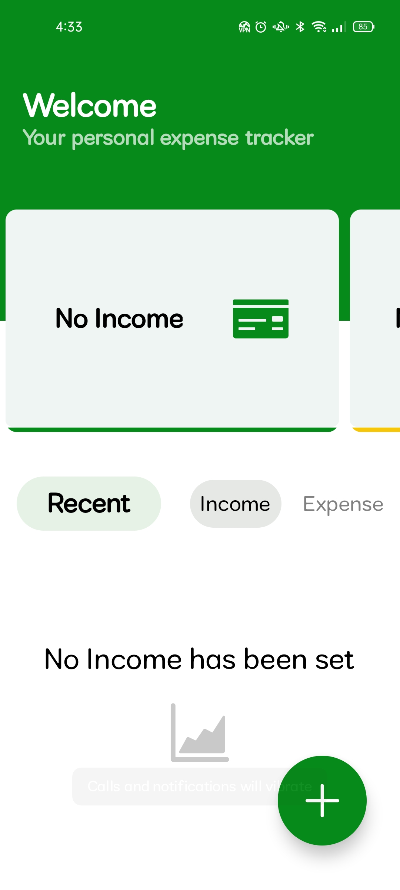
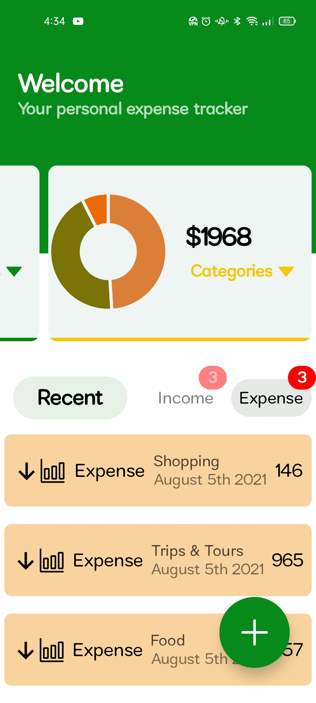
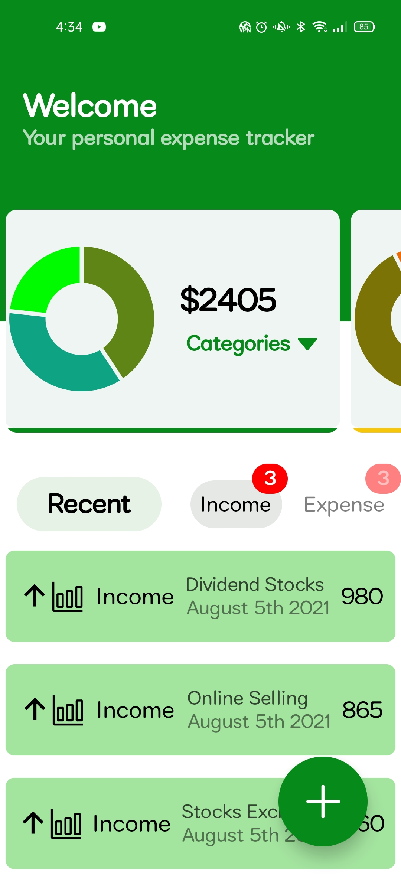

# React Native expense tracker app

It's an expense tracker app that helps you to
manage your finances. It accurately calculates
your income and expenditure.
This app is built using React Native,
 a cross platform mobile application Javascript framework

## Technology used in this app

 - React Native API's and components
 
 - React Hooks(useState, useContext, useReducer)
 
 - React Native Vector icons

 - Styled Components
 
 - Typescript

  
## App Screenshots

  
  
  

  

## 🚀 About Me

I'm an intermediate level React and React Native developer.
I developed many apps, 2D games, web apps etc...
And I have the links of the repositories of all of my 
projects. 

  
## 🔗 Links

  